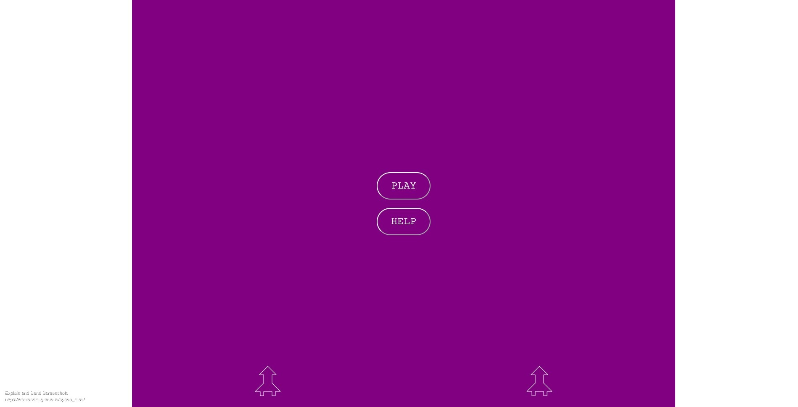
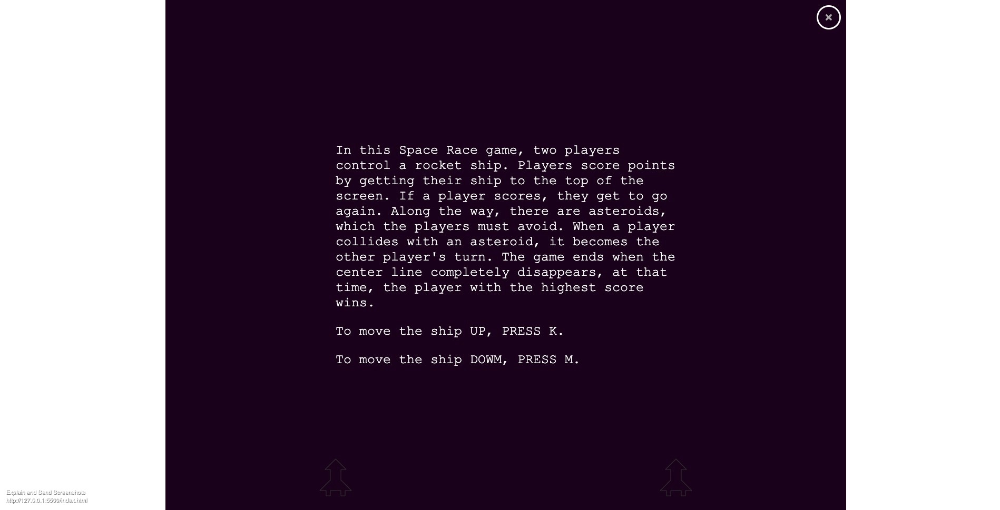

# space_race
In this Space Race game, two players control a rocket ship. Players score points by getting their ship to the top of the screen. If a player scores, they get to go again. Along the way, there are asteroids, which the players must avoid. When a player collides with an asteroid, it becomes the other player's turn. The game ends when the center line completely disappears, at that time, the player with the highest score wins.

## Game Functions
When the help button is clicked:  
    - modal with directions appears  
    - to exit the modal, click the x in the top right corner   

When the play button is clicked:  
    - the game is started  
    - it becomes player1's turn  
    - game music begins paying  
    - center line starts shrinking  

During a player's turn:  
    - Press the K key to move the ship down  
    - Press the M key to move the ship down  

When the player's ship reaches the top of the screen:  
    - player scores a point  
    - sound effect plays  
    - player's ship is returned to the bottom of the screen  
    - player get another turn  
    
When the player's ship collides with an asteroid:  
    - sound effect plays  
    - player's ships are returned to the bottom of the screen  
    - it becomes the other player's turn  

When the center line shrinks to nothingness:  
    - the game is over  
    - end game music begins  
    - modal with the winner's name and play again button is presented  

When the play again button is clicked:  
    - end game music stops playing  
    - game music starts playing  
    - player ships are initialized at the bottom of the screen  
    - player scores are initialized to 0  
    - center line is initialized and starts shrinking  
    - it becomes player1's turn  

## Link to the project's website:
[Click here to see the project live](https://trsalondra.github.io/space_race/)

## How the project looks
Here are a couple of Screenshots of how the final project looks like:
1. Initial page.

2. Modal with insturctions

3. Player 2 turn

4. Player 1 winning modal displaying

## Installation Instructions
1. **Clone or fork the repository**
>using your terminal copy the following code:
> `git clone git@github.com:trsalondra/space_race.git`

2. **Using Visual Studio Code, launch the index.html with the Live Server extension**

## Technologies used
- **HTML** for wedsite formatting.
- **CSS** for website styling.
- **JavaScript** for DOM manipulation.

## Resources
Chris Courses YouTube Videos:
- HTML5 Canvas Tutorial for Beginners | An Intro to Becoming a Pro - Ep. 1  
    https://www.youtube.com/watch?v=EO6OkltgudE&t=7s

- Drawing On the Canvas | HTML5 Canvas Tutorial for Beginners - Ep. 2 
    https://www.youtube.com/watch?v=83L6B13ixQ0&list=PLpPnRKq7eNW3We9VdCfx9fprhqXHwTPXL&index=2&t=19s  

- Animating the Canvas | HTML5 Canvas Tutorial for Beginners - Ep. 3  
    https://www.youtube.com/watch?v=yq2au9EfeRQ&list=PLpPnRKq7eNW3We9VdCfx9fprhqXHwTPXL&index=3

- Interacting with The Canvas | HTML5 Canvas Tutorial for Beginners - Ep. 4  
    https://www.youtube.com/watch?v=vxljFhP2krI&list=PLpPnRKq7eNW3We9VdCfx9fprhqXHwTPXL&index=4

- Pacman Game Tutorial with JavaScript and HTML5 Canvas  
    https://www.youtube.com/watch?v=5IMXpp3rohQ&t=3426s

## Credits 
- Music from https://pixabay.com/music/search/genre/video%20games/
- Sound Effects from https://mixkit.co/free-sound-effects/game/?page=2

## Acknowledgements
I would like to thank my instructors Tishana Trainer and Kasper Kain for their guidance.  
I would also like to thanks my friend Oriana Cruz for her suggestions and motivation.